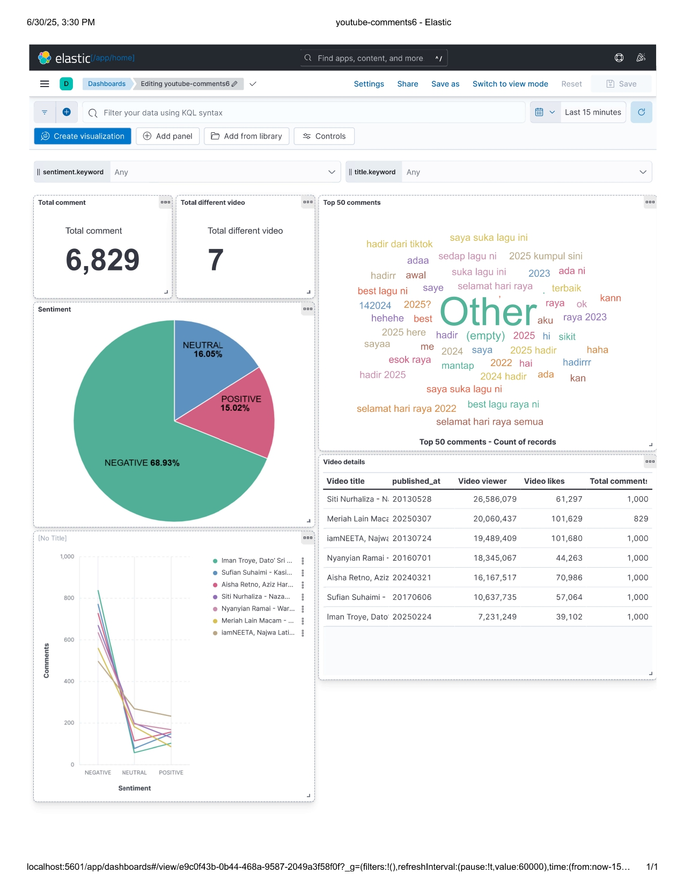
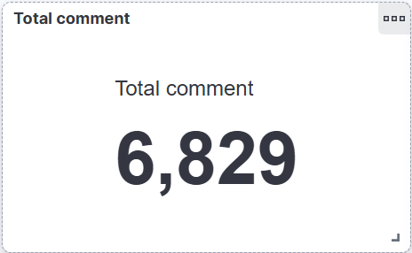
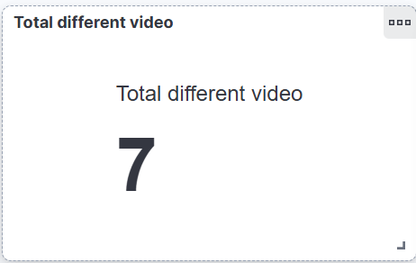
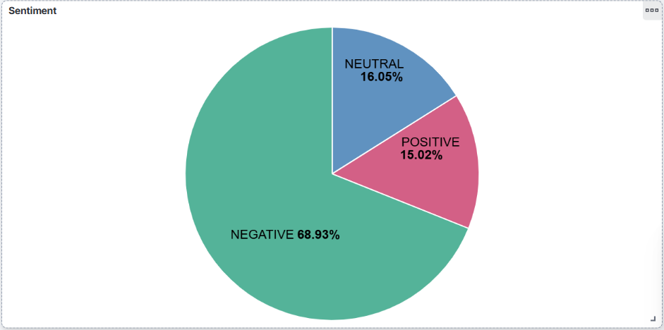
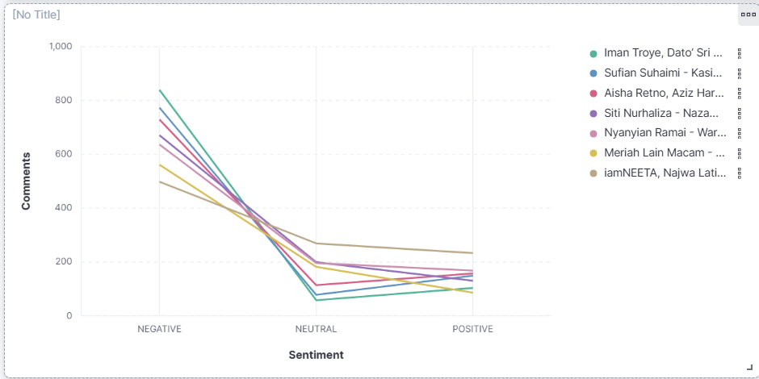
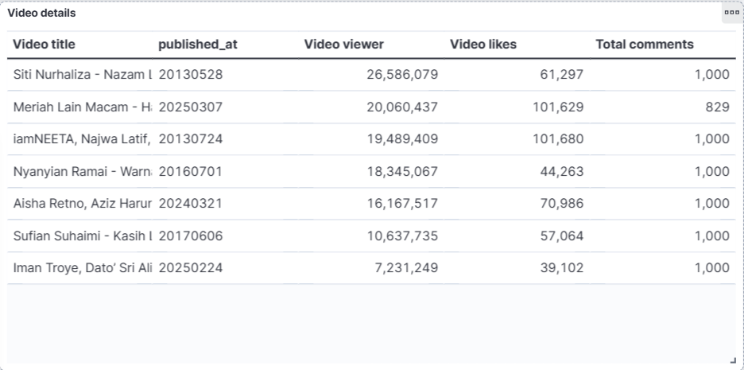
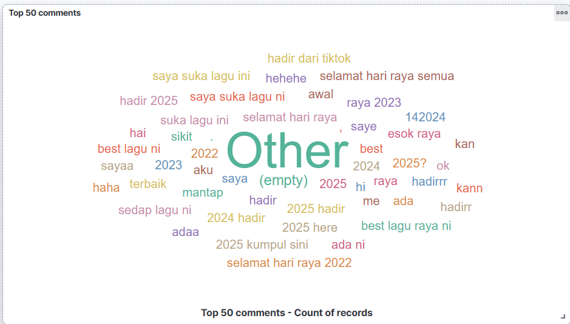

## 📂 Kibana Dashboards

This dashboard folder contains all Kibana-related visualizations and exports used in this project.

### 📸 Contents:

- `*.png` – Images of the real-time sentiment analysis dashboard in Kibana.
- `exported_dashboard_visualization.ndjson` and `exported_dashboard_data.ndjson` – A JSON-formatted export of the Kibana dashboard (importable in other environments).

### 📥 How to Import the Dashboard in Kibana

1. Go to [http://localhost:5601](http://localhost:5601)
2. Navigate to **Stack Management** > **Saved Objects**
3. Click on **Import**
4. Upload the `exported_dashboard.ndjson` file from the `dashboard/` folder
5. Select **"Automatically overwrite conflicts"** if prompted

Your dashboard will now be available under the **Dashboards** section of Kibana.

---

📌 *Note: You must have data already streaming into Elasticsearch for the visualizations to display correctly.*

## 🖼️ Kibana Dashboard Preview

